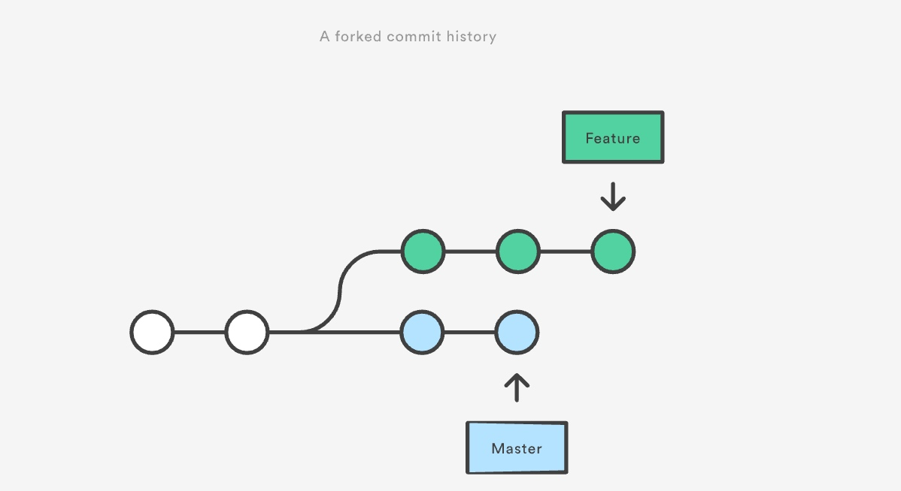
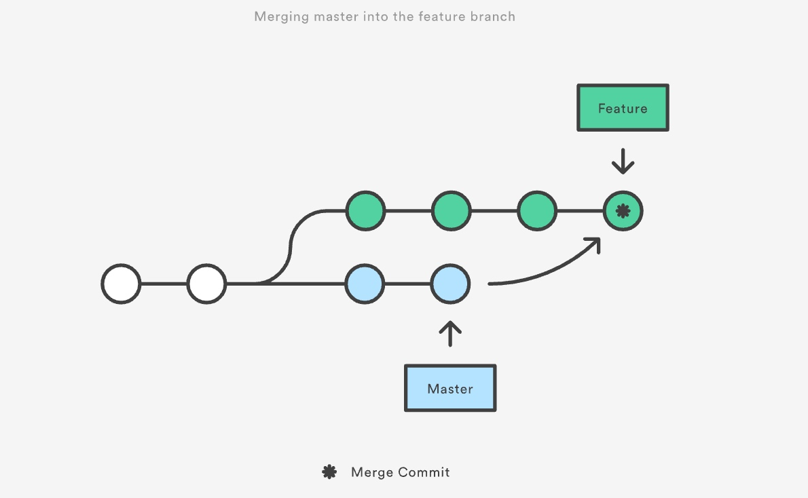
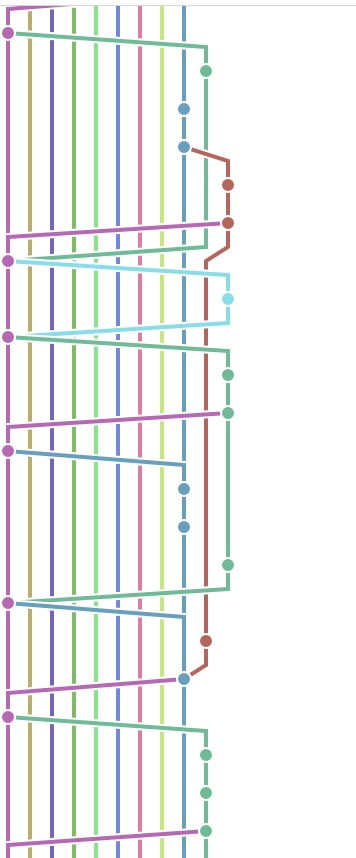
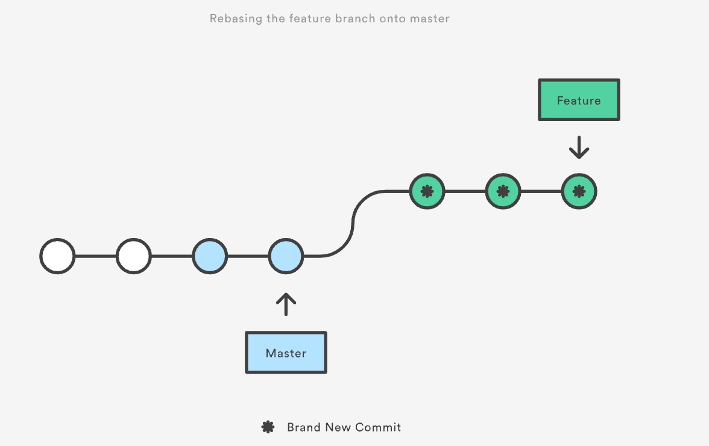
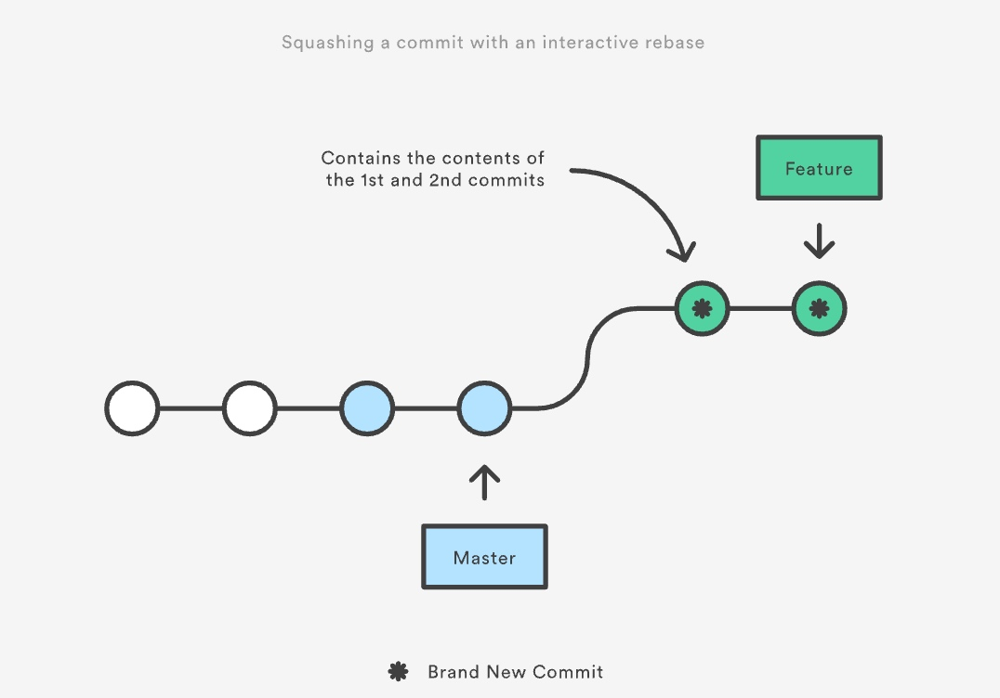
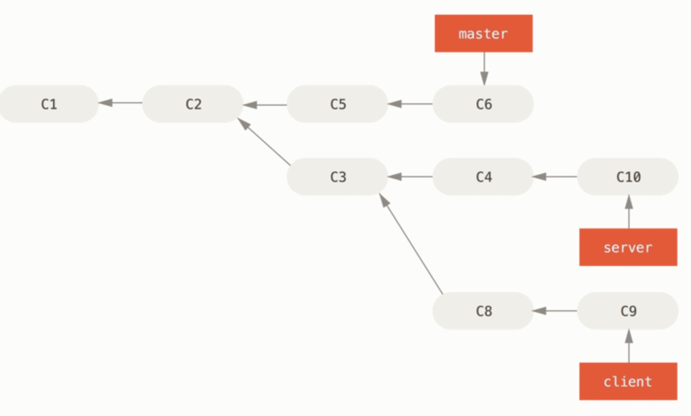
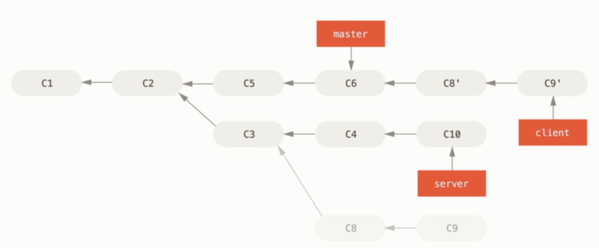

# git 相关

### 2017-07-06

#### git rebase




通常情况下会采用 `git merge master feature` 命令来合并上图所示的两个分支。


乍那么一看，似乎没什么问题，两个分支看上去还是挺协调的。但是还是会有一些问题，比如：

- 无效的 merge commit
- 分支越多，越乱

    


所以，为了解决上面两个问题，`git rebase` 出来了。

主要功能：



不再是把两个需要合并的分支的最后一个commit合并然后提交一个新的merge commit。而是把新增的几个commit直接添加到需要合并的主分支的最后。

具体操作如下：

```
git checkout feature
git rebase master
```

当然，和以往的 `git merge` 不同的是，最后还是要执行 `git merge master feature`称为**fast-forward（快进）合并**，这个merge没有新的merge commit 也没有多余的 branch line.

更棒的是，rebase 支持交互式操作，允许你更改并入新分支的 commit。

- 把-i 传入git rebase 选项来开始一个交互式的rebase过程：

```git
git checkout feature
git rebase -i master
```

- 它会打开一个文本编辑器，显示所有将被移动的提交

```vim
pick 33d5b7a Message for commit #1
pick 9480b3d Message for commit #2
pick 5c67e61 Message for commit #3
```

- 根据提示修改操作，比如：

```vim
pick 33d5b7a Message for commit #1
fixup 9480b3d Message for commit #2
pick 5c67e61 Message for commit #3
```
- 最后效果如下




关于 `git rebase --onto master server client`

以上命令的意思是：“取出 client 分支，找出处于 client 分支和 server 分支的共同祖先之后的修改，然后把它们在 master 分支上重放一遍”。 这理解起来有一点复杂，不过效果非常酷。



关于 rebase 的几个注意点：

- [不要对在你的仓库外有副本的分支执行变基。](https://git-scm.com/book/zh/v2/Git-%E5%88%86%E6%94%AF-%E5%8F%98%E5%9F%BA)

总的原则是，只对尚未推送或分享给别人的本地修改执行变基操作清理历史，从不对已推送至别处的提交执行变基操作，这样，你才能享受到两种方式带来的便利。

- [绝不要在公共的分支上使用它](https://www.atlassian.com/git/tutorials/merging-vs-rebasing)

变基 vs. 合并

有一种观点认为，仓库的提交历史即是 记录实际发生过什么。 它是针对历史的文档，本身就有价值，不能乱改。 从这个角度看来，改变提交历史是一种亵渎，你使用_谎言_掩盖了实际发生过的事情。 如果由合并产生的提交历史是一团糟怎么办？ 既然事实就是如此，那么这些痕迹就应该被保留下来，让后人能够查阅。

另一种观点则正好相反，他们认为提交历史是 项目过程中发生的事。 没人会出版一本书的第一版草稿，软件维护手册也是需要反复修订才能方便使用。 持这一观点的人会使用 rebase 及 filter-branch 等工具来编写故事，怎么方便后来的读者就怎么写。


[参考](https://www.atlassian.com/git/tutorials/merging-vs-rebasing)
[](https://git-scm.com/book/zh/v2/Git-%E5%88%86%E6%94%AF-%E5%8F%98%E5%9F%BA)


http://backlogtool.com/git-guide/cn/stepup/stepup1_4.html

http://hungyuhei.github.io/2012/08/07/better-git-commit-graph-using-pull---rebase-and-merge---no-ff.html


